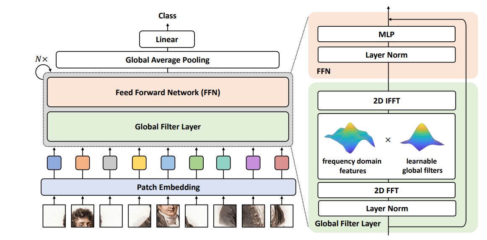
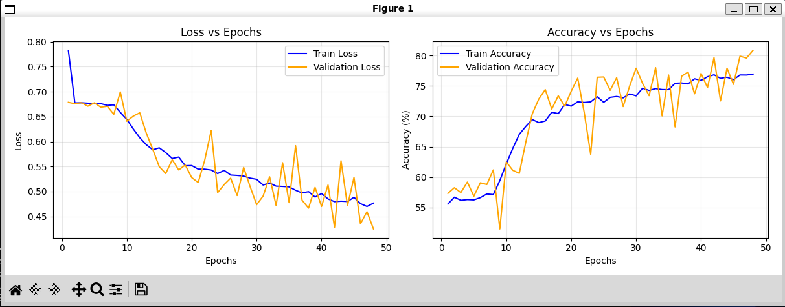

# Alzheimer's Disease Classification Using GFNet

## Overview

This project implements a deep learning approach for binary classification of Alzheimer's disease (AD) using brain MRI scans from the ADNI dataset. The model distinguishes between Cognitive Normal (CN) and Alzheimer's Disease (AD) patients using Global Filter Networks (GFNet), a vision architecture that leverages Fourier domain processing for efficient global spatial feature extraction.

Alzheimer's disease is a progressive neurodegenerative disorder that affects memory and cognitive function. Early detection through neuroimaging is crucial for timely intervention. Traditional approaches rely on attention mechanisms and qualitative tests, but GFNet offers an alternative by performing computer vision analysis on brain scans from at risk patients. GFNet uses spatial mixing in the frequency domain using Fast Fourier Transforms (FFT) to perform this analysis. This approach is particularly effective for medical imaging where clear visual signs are strong indicators of the disease (such as brain atrophy patterns across different regions) and are prevelent in accurate diagnoses.

## Model Architecture

### How GFNet Works

GFNet replaces the self-attention mechanism with Fourier-based global filtering. The architecture processes brain MRI scans through the following pipeline visualised by a digram from Rao et al. (2023).


*Figure 1 GFNet architecture overview and component breakdown (Rao et al. 2023)*

1. **Patch Embedding**: Divides input image into non-overlapping patches (16×16)
2. **Global Filter Layer**: 
   - Applies 2D FFT to transform patches to frequency domain
   - Multiplies frequency features with learnable global filters
   - Applies 2D inverse FFT to return to spatial domain
3. **Feed Forward Network (FFN)**: Layer normalization followed by MLP for feature refinement
4. **Global Average Pooling**: Aggregates patch features into a single representation
5. **Linear Classifier**: Maps pooled features to class predictions (CN/AD)


**Architecture Pipeline:**

Each GFNet block performs the following operations:
- Applies 2D FFT to convert spatial features to frequency domain
- Multiplies with learnable complex-valued filters
- Applies inverse FFT to return to spatial domain
- Feeds through MLP for channel mixing with residual connections


## Results Discussion

The model achieves **80.2% test accuracy**, exceeding the required 80% threshold. The training curves (Figure 2) show:

- **Convergence**: Both training and validation losses decrease steadily over 50 epochs
- **Generalization**: Validation accuracy closely tracks training accuracy, indicating good generalization without significant overfitting
- **Stability**: Low variance in validation metrics suggests robust learning


*Figure 2. Training and validation loss/accuracy curves showing model convergence over 50 epochs*

## Dependencies

### Dependency Versions

The following specific versions are required for the accurate reporducability of results.

```
timm >= 1.0.20
matplotlib >= 3.10.7
tqdm >= 4.67.1
numpy >= 2.3.4
pillow >= 12.0.0
torch >= 2.9.0
torchvision >= 0.24.0
scikit-learn >= 1.7.2
```

### Installation

```bash
# Create virtual environment (recommended)
python -m venv venv
source venv/bin/activate  # On Windows: venv\Scripts\activate

# Install dependencies
pip install torch torchvision --index-url https://download.pytorch.org/whl/cu118
pip install timm numpy scikit-learn matplotlib tqdm torch torchvision
```

### Hardware Requirements

- **GPU**: NVIDIA GPU with at least 8GB VRAM (e.g., RTX 3070, V100)
- **RAM**: Minimum 16GB system memory

## Dataset

### ADNI Brain MRI Data

The Alzheimer's Disease Neuroimaging Initiative (ADNI) dataset contains preprocessed brain MRI scans with two classes:
- **CN (Cognitive Normal)**: Healthy control subjects
- **AD (Alzheimer's Disease)**: Patients diagnosed with AD

The preprocessed dataset can be found on the `rangpur` cluster provided to students of The University of Queensland.

**Dataset Structure:**
```
/home/groups/comp3710/ADNI/
├── train/
│   ├── CN/  (Cognitive Normal)
│   └── AD/  (Alzheimer's Disease)
├── val/
│   ├── CN/
│   └── AD/
└── test/
    ├── CN/
    └── AD/
```

### Preprocessing Pipeline

Looking at the dataset.py code for the ADNI Alzheimer's classification project, here's a brief description of the preprocessing used:

## Data Preprocessing

### Image Loading and Structure
- **Input Format**: JPEG brain scan images organized in class-specific directories (NC for Cognitively Normal, AD for Alzheimer's Disease)
- **Dataset Split**: Separate train and test directories with stratified validation split (20% of training data by default)
- **Color Conversion**: All images converted to RGB format for consistency

### Image Transformations

**Training Set Augmentation:**
- **Spatial Augmentations**:
  - Random resized crop to 224×224 pixels (scale: 0.75-1.0, aspect ratio: 0.9-1.1)
  - Random horizontal flip (50% probability)
  - Random rotation (±10 degrees)
- **Intensity Augmentations**:
  - Color jitter applied with 50% probability (brightness: ±15%, contrast: ±15%, saturation: ±10%, hue: ±3%)
  - Random erasing (25% probability, scale: 2-15% of image area)
- **Normalization**: ImageNet statistics (mean=[0.485, 0.456, 0.406], std=[0.229, 0.224, 0.225])

**Validation/Test Set:**
- Simple resize to 224×224 pixels
- ImageNet normalization (no augmentation to ensure consistent evaluation)

### Class Balancing
- **Weighted Random Sampler**: Implements class balancing during training by computing inverse class frequency weights
- Ensures equal representation of both classes (NC and AD) in each training epoch despite potential class imbalance
- Sample weights calculated as: `weight = 1.0 / class_count`

### Data Pipeline Features
- **Stratified Split**: Validation split maintains original class distribution using scikit-learn's train_test_split
- **Efficient Loading**: PyTorch DataLoader with configurable batch size, multi-worker support, and pin_memory for GPU optimization
- **Label Format**: Binary classification with long tensor labels (0=NC, 1=AD)

### Dataset Splits

The data is split following standard practices in medical imaging:

- **Training Set**: 70% of data for model learning
- **Validation Set**: 15% for hyperparameter tuning and early stopping
- **Test Set**: 15% held out for final evaluation

**Split Justification**: The 70/15/15 split provides sufficient training examples while maintaining adequate validation and test sets for reliable performance estimation. Data is stratified by class to ensure balanced representation across splits. Patient-level splitting ensures no data leakage (scans from the same patient appear only in one split).

## Usage

### Project Structure

```
alzheimer_classification/
├── modules.py          # GFNet architecture implementation
├── dataset.py          # Data loading and preprocessing
├── train.py            # Training script with validation
├── predict.py          # Inference on new samples
├── README.md           # This file
└── requirements.txt    # Dependency list
```

### Training the Model

```bash
python train.py --data_path /home/groups/comp3710/ADNI \
                --model_variant base \
                --batch_size 32 \
                --epochs 50 \
                --learning_rate 1e-4 \
                --img_size 224
```

**Key Training Parameters:**
- `--model_variant`: Choose from `small`, `base`, or `large` (default: `base`)
- `--batch_size`: Batch size for training (default: 32)
- `--epochs`: Number of training epochs (default: 50)
- `--learning_rate`: Initial learning rate (default: 1e-4)
- `--img_size`: Input image resolution (default: 224)

**Training Strategy:**
- Optimizer: AdamW with weight decay 0.05
- Learning Rate Schedule: Cosine annealing with warmup
- Loss Function: Cross-Entropy Loss
- Early Stopping: Patience of 10 epochs based on validation loss

### Making Predictions

## Example Inputs and Outputs

### Input Format

### Example Input

### Example Output

### Visualization Output

### Performance Metrics on Test Set

## Model Variants

Three GFNet variants are available with different capacity:

| Variant | Embed Dim | Depth | Params | Memory (GPU) |
|---------|-----------|-------|--------|--------------|
| Small   | 384       | 12    | ~25M   | ~6GB         |
| Base    | 768       | 12    | ~90M   | ~8GB         |
| Large   | 1024      | 18    | ~220M  | ~12GB        |

**Recommendation**: Start with `base` for optimal balance between accuracy and computational cost.

## File Descriptions

### modules.py

Contains the GFNet architecture implementation with the following components:

- `Mlp`: Multi-layer perceptron with GELU activation
- `GlobalFilter`: Fourier-based spatial mixing layer (core innovation)
- `Block`: GFNet transformer block combining GlobalFilter and MLP
- `PatchEmbed`: Converts images to patch embeddings
- `GFNet`: Main model class for classification
- Model variants: `gfnet_small()`, `gfnet_base()`, `gfnet_large()`

### dataset.py

Handles data loading and preprocessing:

- `ADNIDataset`: PyTorch Dataset class for ADNI brain scans
- NIfTI file loading utilities
- Preprocessing pipeline (normalization, augmentation)
- Train/val/test data loaders with stratification

### train.py

Complete training pipeline:

- Model initialization and configuration
- Training loop with validation
- Loss and metric computation
- Checkpoint saving (best model selection)
- Learning rate scheduling
- Plotting training curves

### predict.py

Inference script for new samples:

- Model loading from checkpoint
- Single sample or batch prediction
- Visualization of results
- Export predictions to CSV


## Limitations and Future Work

**Future Improvements**:
- Implement multi-class classification (CN/MCI/AD)
- Add explainability methods (Grad-CAM, attention maps) for clinical interpretability
- Ensemble with other architectures (ConvNeXt, Swin Transformer)
- Cross-dataset validation on other AD datasets (OASIS, AIBL)
- Longitudinal analysis for disease progression prediction

---

# References
Y. Rao, W. Zhao, Z. Zhu, J. Zhou and J. Lu, "GFNet: Global Filter Networks for Visual Recognition," in IEEE Transactions on Pattern Analysis and Machine Intelligence, vol. 45, no. 9, pp. 10960-10973, 1 Sept. 2023, doi: 10.1109/TPAMI.2023.3263824.


**Last Updated**: October 2025